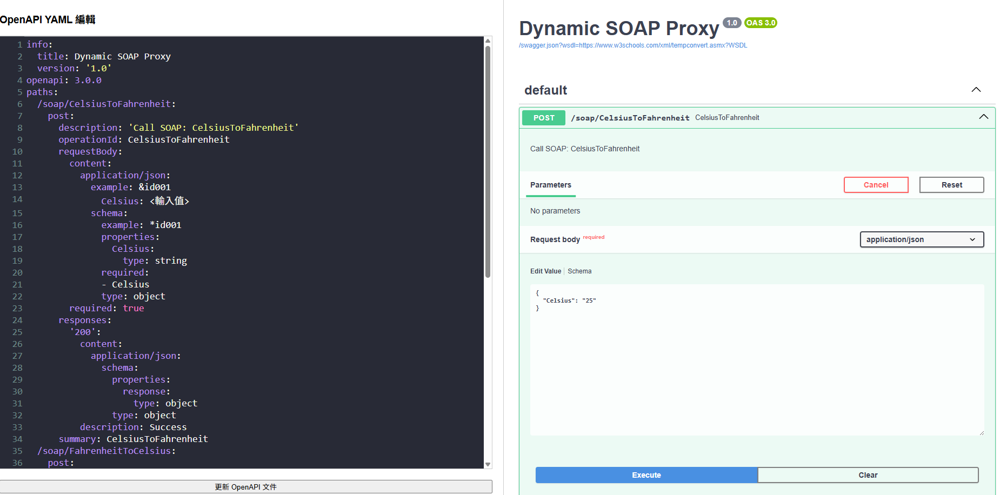
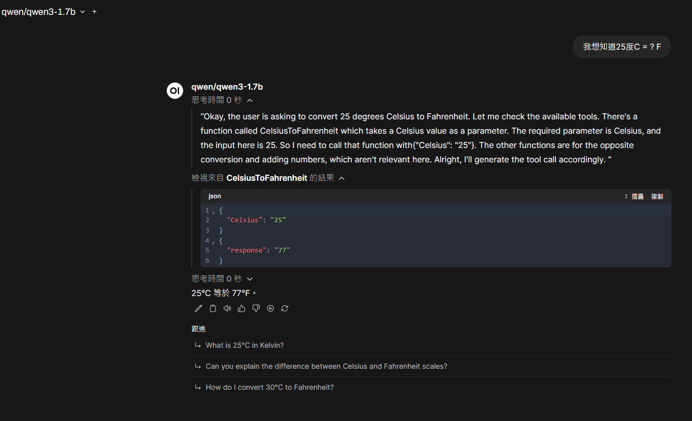

# 🧼 SOAP to OpenAPI 3.0 Proxy

這是一個基於 Flask 的 Web 工具，可將 WSDL (SOAP Web Service) 自動解析成 OpenAPI 3.0 文件，並可透過 Swagger UI 即時編輯、測試與發送 API 請求。

✨ 特別適用於：
- 將老舊 SOAP API 轉成 RESTful JSON 格式
- 快速測試 SOAP API 結構與輸入格式
- 與 Open WebUI等工具整合使用

## ✅ 功能完整性檢查

### ✅ 支援的核心功能：

| 功能 | 狀態 |
|------|------|
| 解析 WSDL 結構 | ✅ 使用 `zeep` 解析器處理 |
| 動態列出所有方法與輸入參數 | ✅ 支援 |
| 自動產生 OpenAPI 3.0 規格 | ✅ 支援，包括 `operationId`, `description`, `requestBody` 等 |
| 支援 Swagger UI 渲染 | ✅ 成功整合 Swagger UI |
| JSON 請求轉 SOAP 請求並轉發 | ✅ 有效 |
| 修改 YAML 並套用到回傳描述 | ✅ 使用 `/update_yaml` 完成 |

---

## ✅ 對 C# WebService（ASP.NET SOAP）支援分析

大部分使用 **ASP.NET WebService (.asmx)** 或 **WCF SOAP WebService (.svc)** 所產生的 WSDL 都屬於 **SOAP 1.1 或 1.2**，這些是符合 `zeep` 能解析的標準。

### ✅ 支援以下常見特性：

- `Document/Literal` 或 `RPC/Encoded` 模式的 SOAP
- 多個 `port` / `service` / `binding`
- 多層 complexType 結構
- 可動態調整 method 名稱與輸入型別


---


# 🚀 快速開始

```bash
# 啟動 Flask 伺服器，並指定 WSDL URL
python .\soap_to_openapi.py https://www.w3schools.com/xml/tempconvert.asmx?WSDL
```
---
---

# 🚀 SOAP TO OPENAPI 3.0



---
---

# 🚀 Open WebUI Demo
